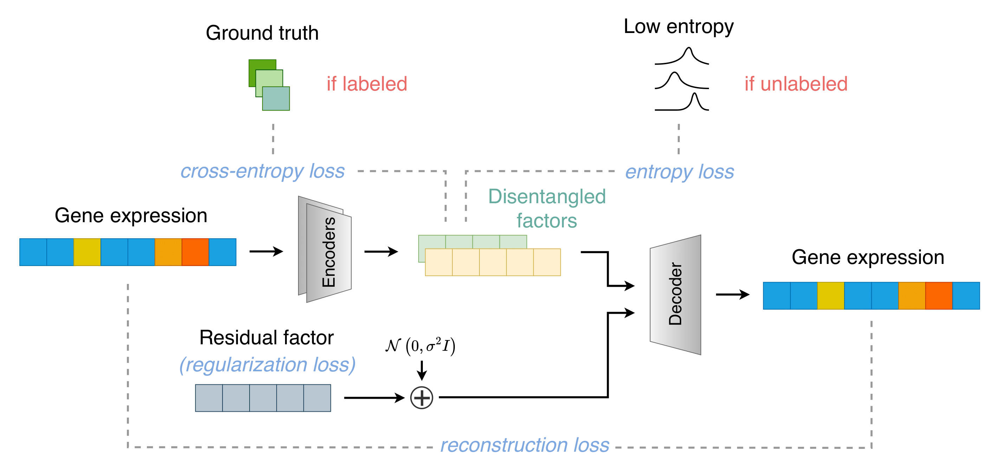

# SCDRL  
**Semi-Supervised Disentangled Representation Learning for Single-Cell RNA Sequencing Data**



## Setting Up  
To get started, create a conda environment for **SCDRL** by following the instructions in [`conda/SCDRL_conda.sh`](./conda/SCDRL_conda.sh).

## Simulation  
The [`SCDRL_data`](./SCDRL_data) folder contains code for reproducing simulation data.  
Users can unzip the `.zip` file to directly obtain the pre-generated data.

## Preparing for SCDRL  
Before running SCDRL, update the file paths in `SCDRL.py` to match your local directory structure.

The input to **SCDRL** is a `.npz` file containing the raw count matrix and ground-truth factor (attribute) annotations. Please refer to the provided simulation data in the [`SCDRL_data`](./SCDRL_data) folder for examples.  

The output is another `.npz` file that stores the performance metrics and predictions for unlabeled data produced by SCDRL.

## Running SCDRL  
To run the model, use the following command:

```bash
python SCDRL.py \
    --seed 42 \
    --percentage 0.05
```

--seed: Random seed for reproducibility.

--percentage: Fraction of labeled data used for semi-supervised training (e.g., 0.05 for 5%).
