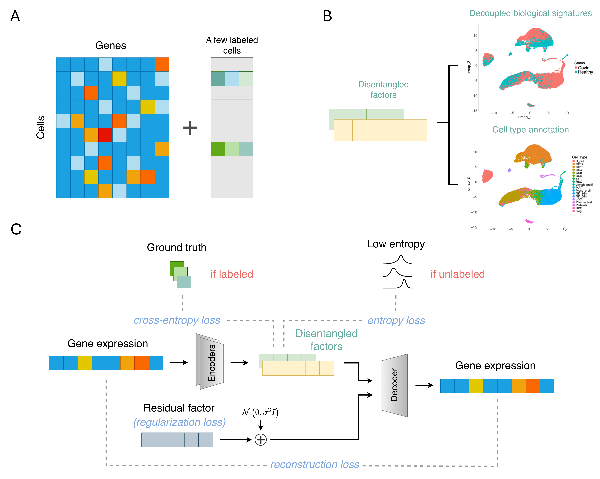

# SCDRL

Semi-Supervised Disentangled Representation Learning for single-cell RNA-seq data.



This repository contains the cleaned source code used for the accepted SCDRL paper. It keeps the training, baseline, evaluation, and plotting code, but excludes datasets, experiment outputs, logs, and generated figures.

## Repository Layout

- `SCDRL.py`: top-level dispatcher for the three SCDRL experiment runners.
- `SCDRL_simulation.py`, `SCDRL_mouse_human.py`, `SCDRL_haniffa.py`: main SCDRL training/evaluation scripts.
- `SCDRL_data/`: data-preparation scripts. Generated `.npz` inputs are not committed.
- `competing_methods/`: baseline runners for `biolord`, `scVI`, and `Seurat`.
- `SCDRL_evaluation/`, `training.py`, `modules.py`, `utils.py`, `disentanglement_metrics.py`: shared model and evaluation code.
- `performance/`: performance aggregation and disentanglement-metric collection scripts.
- `plot/code/`: figure-generation scripts used for the paper.
- `conda/`: environment setup helpers.

## Setup

Example environments:

- `bash conda/SCDRL_conda.sh`
- `bash conda/biolord_conda.sh`
- `bash conda/scVI_conda.sh`

The Seurat scripts expect an R environment named `utopia` with `Seurat`, `reticulate`, and the optional clustering helpers used in the scripts.

## Data Preparation

Generated datasets are intentionally excluded from version control.

Prepare simulation data:

```bash
Rscript SCDRL_data/1.simulation_SymSim.r
python SCDRL_data/2.upload.py
```

Prepare the real-data `.npz` files:

```bash
python SCDRL_data/3.data.py
```

This writes:

- `SCDRL_data/simulation_data.npz`
- `SCDRL_data/haniffa.npz`
- `SCDRL_data/mouse_human.npz`

## Running SCDRL

Run one dataset through the public dispatcher:

```bash
python SCDRL.py --dataset simulation -- --seed 9 --percentage 0.05
python SCDRL.py --dataset mouse_human -- --seed 9 --percentage 0.05
python SCDRL.py --dataset haniffa -- --seed 9 --percentage 0.05
```

Or use the dataset-specific sweep scripts:

```bash
bash SCDRL_simulation.sh
bash SCDRL_mouse_human.sh
bash SCDRL_haniffa.sh
```

Outputs are written to ignored directories such as `results/` and `log_dir/`.

## Running Baselines

Examples:

```bash
bash competing_methods/biolord_simulation.sh
bash competing_methods/scVI_simulation.sh
bash competing_methods/Seurat_simulation.sh
```

Equivalent dataset-specific scripts are provided for `mouse_human` and `haniffa`.

## Performance and Plots

Recommended order after the experiment outputs exist:

```bash
python performance/code/simulation_performance.py --seeds 9 19 29 39 49 59 69 79 89 99 --percentages 0.05 0.15 0.25
python performance/code/mouse_human_performance.py --seeds 9 19 29 39 49 59 69 79 89 99 --percentages 0.05 0.15 0.25
python performance/code/haniffa_performance.py --seeds 9 19 29 39 49 59 69 79 89 99 --percentages 0.05 0.15 0.25
python performance/collect_performance.py
python performance/plot_disentanglement.py
```

Paper figure scripts are under `plot/code/`.

## Notes

- This repo does not include raw datasets, generated result files, logs, or rendered figures.
- `SCDRL.pdf` is the accepted paper PDF.
- `SCDRL.png` is the public-facing overview image used in the README.
